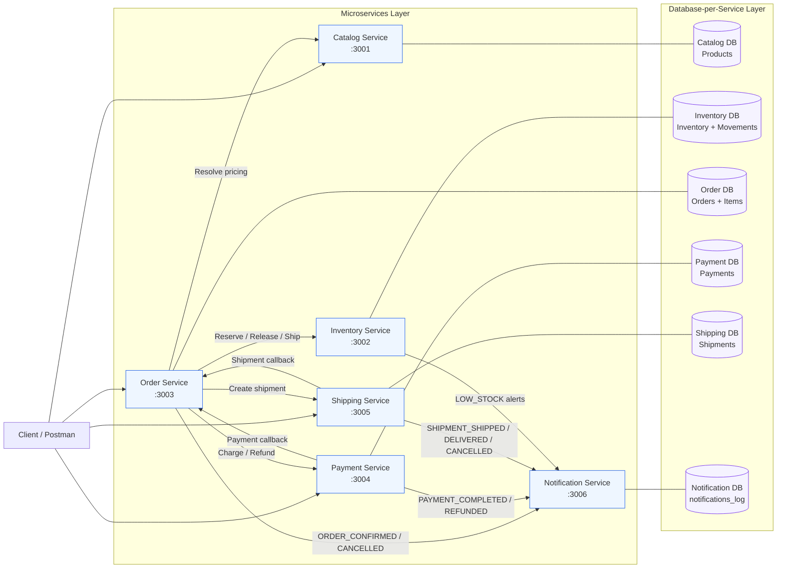
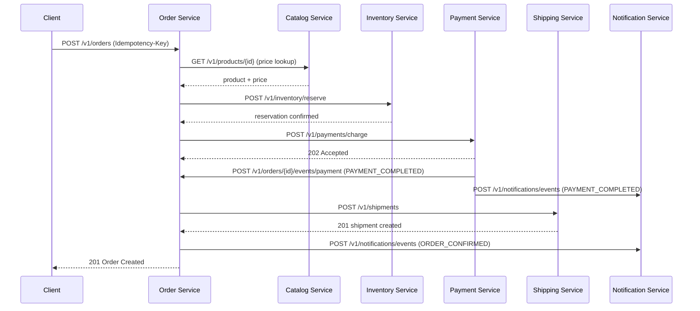
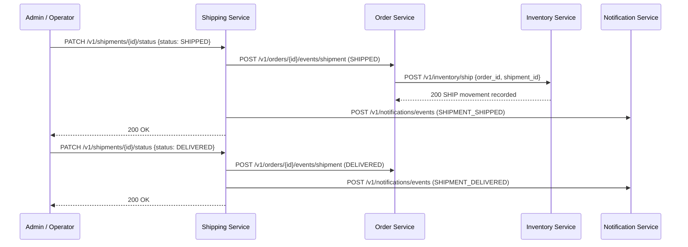
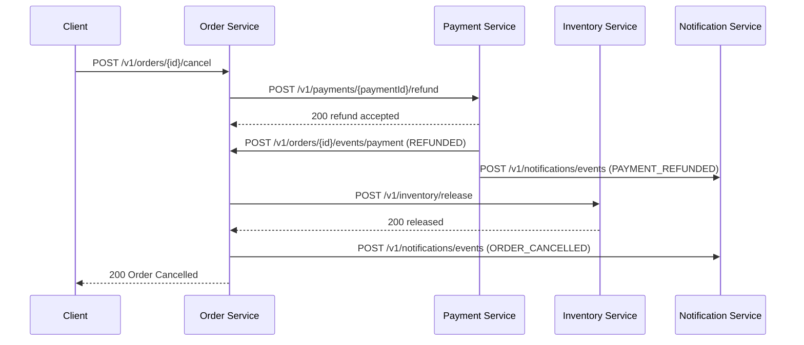
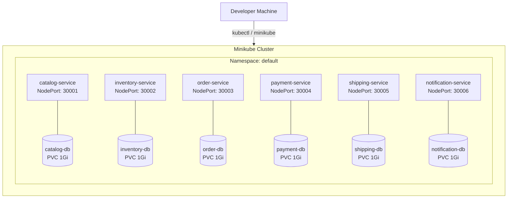
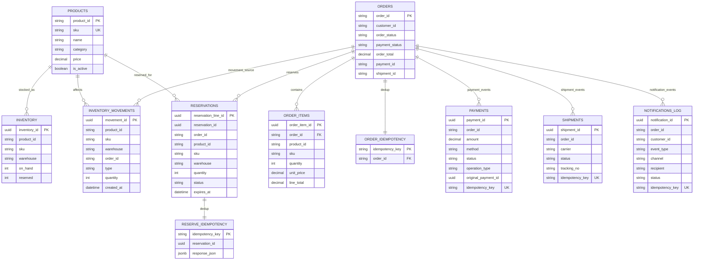

# PS4 Assignment Submission — ECI Microservices Platform

**Course:** Scalable Services  
**Assignment:** PS4  
**Institution:** BITS Pilani – WILP  
**Date:** May 2026

---

## Table of Contents

1. [Group Details](#1-group-details)
2. [Application Description](#2-application-description)
3. [System Architecture](#3-system-architecture)
  - 3.6 Database Schema (ER Diagram)
4. [GitHub Repository Links](#4-github-repository-links)
5. [Step-by-Step Execution Instructions](#5-step-by-step-execution-instructions)
   - 5.1 Pre-requisites
   - 5.2 Task 1 – Health Checks
   - 5.3 Task 2 – Catalog: List Products
   - 5.4 Task 3 – Inventory: List by Warehouse
   - 5.5 Task 4 – Place Order (Reserve → Pay → Ship)
   - 5.6 Task 5 – Idempotency Replay
   - 5.7 Task 6 – Post-Order State Verification
   - 5.8 Task 7 – Direct Payment Charge
   - 5.9 Task 8 – Shipment Lifecycle (PENDING → SHIPPED → DELIVERED)
   - 5.10 Task 9 – Inventory SHIP Movement Verification
   - 5.11 Task 10 – Payment Refund
   - 5.12 Task 11 – Order Cancellation
   - 5.13 Task 12 – Notification Events
   - 5.14 Task 13 – Prometheus Metrics
6. [Running the Full Postman Demo Collection](#6-running-the-full-postman-demo-collection)

---

## 1. Group Details

**Group Number:** 23

| # | Name | Email | Contribution |
|---|------|-------|-------------|
| 1 | Pratham Goel | 2024tm93577@wilp.bits-pilani.ac.in | 20% |
| 2 | Pradeep Kumar Eeda | 2024tm93687@wilp.bits-pilani.ac.in | 20% |
| 3 | Vinutha P | 2025tm93029@wilp.bits-pilani.ac.in | 20% |
| 4 | Arunan S | 2025tm93064@wilp.bits-pilani.ac.in | 20% |
| 5 | Mangam Joshua Evans | 2025tm93068@wilp.bits-pilani.ac.in | 20% |

### Contribution Breakdown

| Member | Responsibilities |
|--------|-----------------|
| Pratham Goel | Catalog Service, OpenAPI specifications, API contract design |
| Pradeep Kumar Eeda | Inventory Service, reservation TTL/reaper, SHIP movement wiring |
| Vinutha P | Payment Service, idempotency, payment ↔ order callbacks, refund flow |
| Arunan S | Order Service, orchestration engine, cancellation/fulfillment wiring, K8s deployment, Postman demo collection |
| Mangam Joshua Evans | Shipping Service, Notification Service, shipment lifecycle, notification event coverage |

---

## 2. Application Description

### ECI – E-Commerce Integration Platform

ECI is a cloud-native, microservices-based e-commerce backend implementing a complete order fulfillment platform. The system follows the **Reserve → Pay → Ship** orchestration pattern across six independently deployable services.

#### Key Design Principles

- **Database-per-Service**: Each service owns its own PostgreSQL instance; no cross-database joins.
- **Idempotency**: All critical write operations (order create, inventory reserve, payment charge/refund, shipment create) accept `Idempotency-Key` headers to safely handle retries.
- **Versioned APIs**: All endpoints are prefixed `/v1` with full OpenAPI 3.0 specifications.
- **Structured Observability**: Pino JSON logging with correlation ID propagation (`x-correlation-id`), Prometheus-compatible `/metrics` endpoints on each service.
- **Containerisation**: Full Docker Compose local stack + Kubernetes manifests (Minikube) with readiness/liveness probes, PVCs, and ConfigMaps.

#### Services Summary

| Service | Port | Responsibility |
|---------|------|---------------|
| Catalog | 3001 | Product catalogue; authoritative pricing source |
| Inventory | 3002 | Stock management: reserve / release / ship; movement audit log; TTL reaper |
| Order | 3003 | Orchestration hub: places, cancels, and tracks orders; computes totals with banker's rounding |
| Payment | 3004 | Idempotent charge and refund; callbacks to Order and Notification |
| Shipping | 3005 | Shipment lifecycle: PENDING → SHIPPED → DELIVERED (or CANCELLED); callbacks to Order and Notification |
| Notification | 3006 | Event log for all business events across Order, Payment, and Shipping |

#### Core Business Workflows

1. **Place Order** – Client → Order → Catalog (pricing) → Inventory (reserve) → Payment (charge) → Shipping (create shipment).
2. **Fulfillment** – PATCH shipment status to `SHIPPED` → Order triggers `POST /v1/inventory/ship` → Inventory records SHIP movement. Then PATCH to `DELIVERED`.
3. **Cancellation & Refund** – Order cancel → Payment refund → Inventory release → Status propagated via callbacks.
4. **Notification Events** – All key lifecycle transitions emit events to the Notification service (`ORDER_CONFIRMED`, `PAYMENT_COMPLETED`, `PAYMENT_REFUNDED`, `SHIPMENT_SHIPPED`, `SHIPMENT_DELIVERED`, `SHIPMENT_CANCELLED`, etc.).

---

## 3. System Architecture

### 3.1 High-Level Architecture Diagram



### 3.2 Place Order Sequence Diagram



### 3.3 Fulfillment Sequence Diagram



### 3.4 Cancellation / Refund Sequence Diagram



### 3.5 Deployment Architecture (Kubernetes / Minikube)



### 3.6 Database Schema (ER Diagram)

The platform uses strict **database-per-service** isolation. Logical links such as `order_id` are shared as business identifiers across services, while physical foreign keys are enforced only inside each service database.



#### Service-Wise Physical Schema

| Service DB | Tables |
|------------|--------|
| Catalog DB | `products` |
| Inventory DB | `inventory`, `inventory_movements`, `reservations`, `reserve_idempotency` |
| Order DB | `orders`, `order_items`, `order_idempotency` |
| Payment DB | `payments` |
| Shipping DB | `shipments` |
| Notification DB | `notifications_log` |

#### Important Notes

- Physical foreign keys exist only inside a service (e.g., `order_items.order_id -> orders.order_id`).
- Cross-service references (`order_id`, `payment_id`, `shipment_id`) are integration keys passed through APIs/events, not SQL FK constraints.
- Inventory auditability is captured in `inventory_movements` with `type IN ('RESERVE', 'RELEASE', 'SHIP')`.
- Idempotency is persisted in service-specific tables/columns (`order_idempotency`, `reserve_idempotency`, and unique `idempotency_key` in `payments`/`shipments`/`notifications_log`).

---

## 4. GitHub Repository Links

| Service | Repository URL |
|---------|---------------|
| Full Application (parent + K8s scripts) | https://github.com/Arunan131998/eci-full-application/tree/main |
| Catalog Service | https://github.com/Arunan131998/ECI-catalog-service/tree/main |
| Inventory Service | https://github.com/Arunan131998/eci-inventory-service/tree/main |
| Order Service | https://github.com/Arunan131998/eci-order-service/tree/main |
| Payment Service | https://github.com/Arunan131998/eci-payment-service/tree/main |
| Shipping Service | https://github.com/Arunan131998/eci-shipping-service/tree/main |
| Notification Service | https://github.com/Arunan131998/eci-notification-service/tree/main |

---

## 5. Step-by-Step Execution Instructions

### 5.1 Pre-requisites

#### Software Requirements

| Tool | Version | Purpose |
|------|---------|---------|
| Docker Desktop | ≥ 24 | Containerised local run |
| Docker Compose | ≥ 2.x | Multi-service local stack |
| Node.js | ≥ 20 | Service runtime (if running bare-metal) |
| Minikube | ≥ 1.32 | Kubernetes local cluster |
| kubectl | ≥ 1.28 | K8s management |
| Postman | ≥ 10 | API demo collection |
| PowerShell | ≥ 7 | Automation scripts |

#### Clone the Repository

```bash
git clone --recurse-submodules https://github.com/Arunan131998/eci-full-application.git
cd eci-full-application
```

If already cloned without submodules:

```bash
git submodule update --init --recursive
```

#### Start All Services (Docker Compose)

```bash
docker compose -f docker-compose.yml up --build -d
```

Wait ~30 seconds for PostgreSQL instances and services to become healthy.

> **Screenshot Placeholder 1** – Docker Desktop showing all 12 containers healthy (6 services + 6 databases).

---

### 5.2 Task 1 – Health Checks

Verify all six services are running by calling each `/health` endpoint.

**Using Postman Demo Collection:**
Import `postman/eci-assignment-demo.postman_collection.json` and run requests **01 – 06**.

**Manual cURL (example for all services):**

```bash
curl http://localhost:3001/health   # Catalog
curl http://localhost:3002/health   # Inventory
curl http://localhost:3003/health   # Order
curl http://localhost:3004/health   # Payment
curl http://localhost:3005/health   # Shipping
curl http://localhost:3006/health   # Notification
```

**Expected Response (each service):**
```json
{ "status": "ok", "service": "catalog-service" }
```

> **Screenshot Placeholder 2** – Postman showing 200 OK for all 6 health check requests.

---

### 5.3 Task 2 – Catalog: List Products

Verify the product catalogue is seeded and accessible.

**Request:** `GET http://localhost:3001/v1/products`

**Expected Response:**
```json
{
  "products": [
    { "id": "...", "name": "Laptop Pro 15", "sku": "SKU001", "price": "999.99" },
    { "id": "...", "name": "Wireless Mouse", "sku": "SKU002", "price": "29.99" }
  ]
}
```

> **Screenshot Placeholder 3** – Postman GET /v1/products showing seeded products.

---

### 5.4 Task 3 – Inventory: List by Warehouse

Check stock levels at the warehouse level.

**Request:** `GET http://localhost:3002/v1/inventory?warehouse_id=WH-001`

**Expected Response:**
```json
{
  "inventory": [
    { "sku": "SKU001", "on_hand": 100, "reserved": 0, "available": 100 },
    { "sku": "SKU002", "on_hand": 200, "reserved": 0, "available": 200 }
  ]
}
```

> **Screenshot Placeholder 4** – Postman showing inventory for WH-001 with on_hand/reserved counts.

---

### 5.5 Task 4 – Place Order (Reserve → Pay → Ship)

This is the core orchestration flow.

**Step 1:** Generate an idempotency key (e.g., a UUID or timestamp string).

**Request:**
```
POST http://localhost:3003/v1/orders
Headers:
  Content-Type: application/json
  Idempotency-Key: demo-order-001
```

**Request Body:**
```json
{
  "customer_id": "CUST-001",
  "customer_email": "customer@example.com",
  "warehouse_id": "WH-001",
  "items": [
    { "product_id": "<product_id_from_catalog>", "quantity": 2 }
  ]
}
```

**Expected Response:**
```json
{
  "order": {
    "id": "...",
    "status": "CONFIRMED",
    "payment_status": "SUCCESS",
    "shipment_id": "...",
    "total_amount": "...",
    "items": [...]
  }
}
```

> **Screenshot Placeholder 5** – Postman showing 201 Created with order status CONFIRMED, payment_status SUCCESS.

**Step 2 – Verify Order state:**

```
GET http://localhost:3003/v1/orders/{orderId}
```

> **Screenshot Placeholder 6** – Order GET showing CONFIRMED status and all nested IDs.

---

### 5.6 Task 5 – Idempotency Replay

Send the **identical** order request a second time with the **same** `Idempotency-Key`.

**Same request as Task 4, same headers/body:**

**Expected Behaviour:** Returns `200 OK` (not 201) with the **same order object** — no duplicate order created, no duplicate charge.

> **Screenshot Placeholder 7** – Postman showing idempotency replay returns 200 with identical orderId.

---

### 5.7 Task 6 – Post-Order State Verification

After placing the order, verify that Inventory and Shipping were updated.

#### 6a. Inventory Shows Reserved Stock

```
GET http://localhost:3002/v1/inventory?warehouse_id=WH-001
```

The `reserved` count should now be > 0 for the ordered SKU.

> **Screenshot Placeholder 8** – Inventory showing reserved > 0 after order.

#### 6b. Payment Record Accessible

```
GET http://localhost:3004/v1/payments/{paymentId}
```

**Expected:** `operation_type: "CHARGE"`, `status: "SUCCESS"`.

> **Screenshot Placeholder 9** – Payment GET showing CHARGE / SUCCESS.

#### 6c. Shipment Created

```
GET http://localhost:3005/v1/shipments/{shipmentId}
```

**Expected:** `shipment_status: "PENDING"`.

> **Screenshot Placeholder 10** – Shipment GET showing PENDING status.

---

### 5.8 Task 7 – Direct Payment Charge

Demonstrate the Payment Service independently.

**Request:**
```
POST http://localhost:3004/v1/payments/charge
Headers:
  Content-Type: application/json
  Idempotency-Key: direct-charge-001
```

**Request Body:**
```json
{
  "order_id": "DIRECT-ORDER-001",
  "amount": 49.99,
  "currency": "USD",
  "customer_email": "test@example.com"
}
```

**Expected:** `201 Created`, `status: "SUCCESS"`.

> **Screenshot Placeholder 11** – Direct payment charge showing 201 SUCCESS.

---

### 5.9 Task 8 – Shipment Lifecycle (PENDING → SHIPPED → DELIVERED)

#### Step 1 – Create Shipment Directly

```
POST http://localhost:3005/v1/shipments
```

```json
{
  "order_id": "TEST-ORDER-001",
  "warehouse_id": "WH-001",
  "destination_address": "123 Main St, Test City, TC 00001"
}
```

**Expected:** `201 Created`, `shipment_status: "PENDING"`.

> **Screenshot Placeholder 12** – New shipment created with PENDING status.

#### Step 2 – Mark SHIPPED

```
PATCH http://localhost:3005/v1/shipments/{shipmentId}/status
```

```json
{ "status": "SHIPPED" }
```

**Expected:** `200 OK`, `shipment_status: "SHIPPED"`.

> **Screenshot Placeholder 13** – Shipment PATCH returning SHIPPED status.

#### Step 3 – Mark DELIVERED

```
PATCH http://localhost:3005/v1/shipments/{shipmentId}/status
```

```json
{ "status": "DELIVERED" }
```

**Expected:** `200 OK`, `shipment_status: "DELIVERED"`.

> **Screenshot Placeholder 14** – Shipment PATCH returning DELIVERED status.

---

### 5.10 Task 9 – Inventory SHIP Movement Verification

After shipment is marked **SHIPPED**, the Order service triggers an inventory SHIP movement.

**Request:**
```
GET http://localhost:3002/v1/inventory/movements?order_id={orderId}
```

**Expected:** A movement with `movement_type: "SHIP"` should appear.

> **Screenshot Placeholder 15** – Inventory movements listing showing SHIP type movement.

---

### 5.11 Task 10 – Payment Refund

#### Step 1 – Request a Refund

```
POST http://localhost:3004/v1/payments/{paymentId}/refund
Headers:
  Content-Type: application/json
  Idempotency-Key: refund-001
```

**Expected:** `200 OK`, `status: "REFUNDED"`.

> **Screenshot Placeholder 16** – Payment refund response showing REFUNDED.

#### Step 2 – Verify Order Receives Refund Callback

```
GET http://localhost:3003/v1/orders/{orderId}
```

**Expected:** `payment_status: "REFUNDED"`.

> **Screenshot Placeholder 17** – Order GET showing payment_status REFUNDED after callback.

#### Step 3 – Verify Payment List Shows REFUND Entry

```
GET http://localhost:3004/v1/payments?order_id={orderId}
```

**Expected:** Two rows — one `CHARGE` and one `REFUND`.

> **Screenshot Placeholder 18** – Payment list showing CHARGE + REFUND rows.

---

### 5.12 Task 11 – Order Cancellation

**Request:**
```
POST http://localhost:3003/v1/orders/{orderId}/cancel
```

**Expected:** `200 OK`, `status: "CANCELLED"`.

> **Screenshot Placeholder 19** – Order cancel response showing CANCELLED status.

**Verify inventory was released:**
```
GET http://localhost:3002/v1/inventory?warehouse_id=WH-001
```

The `reserved` count should return to 0.

> **Screenshot Placeholder 20** – Inventory showing reserved = 0 after cancellation.

---

### 5.13 Task 12 – Notification Events

Verify that business events have been logged across the entire workflow.

**Request:**
```
GET http://localhost:3006/v1/notifications
```

**Expected events visible in log:**

| Event Type | Triggered By |
|-----------|-------------|
| `ORDER_CONFIRMED` | Order creation |
| `PAYMENT_COMPLETED` | Successful charge |
| `SHIPMENT_SHIPPED` | Shipment marked SHIPPED |
| `SHIPMENT_DELIVERED` | Shipment marked DELIVERED |
| `PAYMENT_REFUNDED` | Refund processed |
| `ORDER_CANCELLED` | Order cancellation |

> **Screenshot Placeholder 21** – Notification list showing all event types logged.

**Optional – Direct Event Post:**
```
POST http://localhost:3006/v1/notifications/events
```

```json
{
  "event_type": "TEST_EVENT",
  "order_id": "TEST-001",
  "message": "Manual test event"
}
```

> **Screenshot Placeholder 22** – Direct event post to notification service returning 201.

---

### 5.14 Task 13 – Prometheus Metrics

Each service exposes a `/metrics` Prometheus endpoint. Verify below.

**Order Metrics:**
```
GET http://localhost:3003/metrics
```

Look for:
- `orders_placed_total`

> **Screenshot Placeholder 23** – Order /metrics showing orders_placed_total counter.

**Payment Metrics:**
```
GET http://localhost:3004/metrics
```

Look for:
- `payments_failed_total`

> **Screenshot Placeholder 24** – Payment /metrics showing payments_failed_total counter.

**Inventory Metrics:**
```
GET http://localhost:3002/metrics
```

Look for:
- `inventory_reserve_latency_ms`
- `stockouts_total`

> **Screenshot Placeholder 25** – Inventory /metrics showing latency histogram and stockouts counter.

---

## 6. Running the Full Postman Demo Collection

The complete end-to-end demo is packaged as a single Postman collection at:

```
postman/eci-assignment-demo.postman_collection.json
```

### Import Instructions

1. Open **Postman**.
2. Click **Import** → **File**.
3. Select `postman/eci-assignment-demo.postman_collection.json`.
4. The collection **"ECI Assignment Demo"** will appear in your sidebar.

### Reset Demo Data Before Running

```powershell
# From the repo root
./reset-demo-data.ps1
```

This truncates transactional tables while preserving seed data.

### Run the Collection

1. Click the collection name → **Run collection**.
2. Click **Run ECI Assignment Demo**.
3. The runner will execute all **26 requests** in sequence.

### Collection Structure (26 Requests)

| # | Name | Method | Endpoint |
|---|------|--------|----------|
| 01–06 | Health Checks | GET | `/{service}/health` |
| 07 | Catalog: List Products | GET | `/v1/products` |
| 08 | Inventory: By Warehouse | GET | `/v1/inventory?warehouse_id=WH-001` |
| 09 | Place Order | POST | `/v1/orders` |
| 10 | Idempotency Replay | POST | `/v1/orders` (same key) |
| 10a | Order GET | GET | `/v1/orders/{orderId}` |
| 10b | Inventory: After Reserve | GET | `/v1/inventory?warehouse_id=WH-001` |
| 10c | Inventory: By SKU1 | GET | `/v1/inventory?sku=SKU001` |
| 10d | Inventory: All | GET | `/v1/inventory` |
| 10e | Payment GET | GET | `/v1/payments/{paymentId}` |
| 10f | Shipment GET | GET | `/v1/shipments/{shipmentId}` |
| 13 | Direct Charge | POST | `/v1/payments/charge` |
| 14 | Create Shipment | POST | `/v1/shipments` |
| 14a | Shipment GET (PENDING) | GET | `/v1/shipments/{shipmentId}` |
| 15 | Mark SHIPPED | PATCH | `/v1/shipments/{id}/status` |
| 15a | Inventory Movements | GET | `/v1/inventory/movements` |
| 16 | Mark DELIVERED | PATCH | `/v1/shipments/{id}/status` |
| 17 | Payment Refund | POST | `/v1/payments/{paymentId}/refund` |
| 17a | Order: Verify REFUNDED | GET | `/v1/orders/{orderId}` |
| 17b | Payments List | GET | `/v1/payments?order_id=...` |
| 17c | Notification List | GET | `/v1/notifications` |
| 18 | Notification Direct Event | POST | `/v1/notifications/events` |
| 19 | Order Metrics | GET | `/metrics` |
| 20 | Payment Metrics | GET | `/metrics` |
| 21 | Inventory Metrics | GET | `/metrics` |
| 22 | Shipment GET (DELIVERED) | GET | `/v1/shipments/{shipmentId}` |
| 23 | Order Cancel | POST | `/v1/orders/{orderId}/cancel` |

> **Screenshot Placeholder 26** – Postman Collection Runner showing all 26 requests passing (green).

---

## Appendix A – Environment Variables Summary

| Variable | Used By | Value (Docker Compose) |
|----------|---------|------------------------|
| `CATALOG_BASE_URL` | Order | `http://catalog-service:3001` |
| `INVENTORY_BASE_URL` | Order | `http://inventory-service:3002` |
| `PAYMENT_BASE_URL` | Order | `http://payment-service:3004` |
| `SHIPPING_BASE_URL` | Order | `http://shipping-service:3005` |
| `NOTIFICATION_BASE_URL` | Order, Payment, Shipping, Inventory | `http://notification-service:3006` |
| `ORDER_CALLBACK_URL` | Payment, Shipping | `http://order-service:3003/v1/orders` |
| `DATABASE_URL` | All | `postgresql://user:pass@{svc}-db:5432/{db}` |

## Appendix B – Key OpenAPI Spec Files

| File | Description |
|------|-------------|
| `api-docs/catalog.openapi.yaml` | Catalog API spec |
| `api-docs/inventory.openapi.yaml` | Inventory API spec |
| `api-docs/order.openapi.yaml` | Order API spec |
| `api-docs/payment.openapi.yaml` | Payment API spec |
| `api-docs/shipping.openapi.yaml` | Shipping API spec |
| `api-docs/notification.openapi.yaml` | Notification API spec |

## Appendix C – Deployment Commands

### Docker Compose (Local)

```bash
# Start all services
docker compose -f docker-compose.yml up --build -d

# View logs for a specific service
docker compose logs -f order-service

# Stop all services
docker compose down -v
```

### Minikube / Kubernetes

```powershell
# Start minikube
minikube start --driver=docker

# Deploy all services
./deploy-minikube.ps1

# Seed reference data
./seed-minikube.ps1

# Clean transaction data
./clean-minikube-db.ps1

# Get service URLs
minikube service list
```

---

*End of Submission Report — Group 23*
